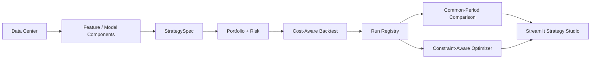

# QuantLab Strategy Studio

Design, backtest, compare, optimize, and version customizable quantitative
strategies through a shared research and portfolio engine.

Factor models, technical rules, machine learning, LSTM, and Transformer
forecasts are interchangeable signal components rather than the identity of the
project. See [docs/PROJECT_PLAN.md](docs/PROJECT_PLAN.md) for the platform plan.
The active product roadmap is tracked in [docs/V1_1_PLAN.md](docs/V1_1_PLAN.md).

## Current Scope

- Strategy Studio: versioned YAML specifications, run registry, comparison,
  constraints, grid/random search, and Pareto candidates
- Chinese no-code strategy wizard with multi-signal, portfolio, risk, and
  execution controls, plus an advanced YAML mode
- Reversible strategy lifecycle management with history, diff, archive,
  soft-delete, and restore
- Frozen-strategy rolling OOS evaluation with purge gaps and non-overlapping
  Walk-forward folds
- Unified same-calendar OOS robustness checks for costs, lag, Top-K, and
  rebalance frequency
- Universe: configurable liquid US equities (MVP list included)
- Market data: Nasdaq daily OHLCV or validated local CSV imports
- Storage: immutable per-symbol raw Parquet files and a clean panel dataset
- Schema: `(date, ticker, open, high, low, close, adj_close, volume)`
- Reproducibility: YAML configuration, CLI entry point, metadata manifest
- Data quality: calendar coverage, stale prices, zero volume, and return outliers
- Dataset: purged chronological splits and train-only feature normalization
- Model research: baselines, recurrent models, and correlation-aware Transformer
- Factor research: 20 Alpha101-compatible signals, IC, Rank IC, and quantiles
- Strategy research: long-only top-K and long-short quantile target weights
- Prediction signals: model forecasts can be converted into strategy inputs
- Backtesting: NAV, holdings, costs, turnover, Sharpe, drawdown, and CAGR
- Diagnostics: tail risk, benchmark-relative metrics, financing, and regimes

## Architecture



The factor and model paths share the same portfolio and backtest contracts, so
their out-of-sample results can be compared under identical execution and risk
assumptions.

## Strategy Studio Quick Start

```powershell
python scripts/run_studio_strategy.py --spec strategies/factor_top10.yaml
python scripts/optimize_studio_strategy.py --config configs/studio_optimizer.yaml
python scripts/recommend_studio_strategies.py --profile configs/studio_profile.yaml
python scripts/build_studio_report.py
python scripts/run_studio_walk_forward.py --config configs/studio_walk_forward.yaml
python scripts/run_studio_robustness.py --config configs/studio_robustness.yaml
```

Every run is stored under `artifacts/studio/runs/<run_id>` with the exact
StrategySpec, data and signal hashes, target weights, trades, equity curve,
metrics, package versions, and Git commit. Multiple run IDs can be compared:

```powershell
python scripts/compare_studio_runs.py <run-id-1> <run-id-2>
```

See the generated [Strategy Studio results](docs/STRATEGY_STUDIO_RESULTS.md)
for the current registered-run comparison and recommendation boundaries.

## Quick Start

```powershell
python -m venv .venv
.\.venv\Scripts\Activate.ps1
python -m pip install -e ".[dev,ml]"
python scripts/download_market_data.py --config configs/data.yaml
# Or import licensed CSV files when the live provider is unavailable:
# python scripts/import_market_csv.py --config configs/csv_import.yaml
python scripts/analyze_market_quality.py --config configs/data_quality.yaml
python scripts/build_features.py --config configs/features.yaml
python scripts/build_alphas.py --config configs/alphas.yaml
python scripts/build_factor_panel.py --config configs/factor_panel.yaml
python scripts/build_catalog.py --config configs/catalog.yaml
python scripts/validate_factors.py --config configs/factors.yaml
python scripts/select_factors.py --config configs/factor_selection.yaml
python scripts/build_factor_signals.py --config configs/factor_signals.yaml
python scripts/build_strategy.py --config configs/strategy.yaml
python scripts/run_backtest.py --config configs/backtest.yaml
python scripts/run_benchmarks.py --config configs/benchmarks.yaml
python scripts/analyze_regimes.py --config configs/regime.yaml
python scripts/run_sensitivity.py --config configs/sensitivity.yaml
python scripts/build_attribution.py --config configs/attribution.yaml
python scripts/compare_equity_curves.py --config configs/equity_comparison.yaml
python scripts/build_report.py --config configs/reporting.yaml
python scripts/build_dataset.py --config configs/dataset.yaml
python scripts/run_baselines.py --config configs/baselines.yaml
python scripts/train_recurrent.py --config configs/recurrent.yaml
python scripts/train_transformer.py --config configs/transformer.yaml
python scripts/build_prediction_signals.py --config configs/prediction_signals.yaml
python scripts/build_strategy.py --config configs/model_strategy.yaml
python scripts/run_backtest.py --config configs/model_backtest.yaml
python scripts/compare_equity_curves.py --config configs/equity_comparison.yaml
pytest
```

For the GUI:

```powershell
python -m pip install -e ".[dev,ml,gui]"
streamlit run app/streamlit_app.py
```

Use a short date range while checking a new environment:

```powershell
python scripts/download_market_data.py --config configs/data.yaml `
  --start 2024-01-01 --end 2024-03-01 --tickers AAPL MSFT NVDA
```

When a live provider is unavailable, use the explicitly synthetic
[deterministic smoke workflow](docs/SMOKE_WORKFLOW.md) to verify runtime
contracts without publishing its performance numbers.

For real externally downloaded data, use the
[validated CSV import workflow](docs/CSV_MARKET_IMPORT.md). It records source
hashes and writes the same canonical market panel consumed by downstream jobs.

## Project Layout

```text
configs/               Experiment and data configuration
data/
  raw/                 Source-aligned downloads (gitignored)
  processed/           Clean model inputs (gitignored)
  metadata/            Run manifests and data-quality reports
docs/                  Roadmap, design decisions, and research notes
notebooks/             Exploration and result communication
scripts/               Reproducible command-line workflows
src/equity_transformer/
  alphas/              Formulaic alpha registry and batch calculation
  data/                Universe, providers, validation, storage, and DuckDB catalog
  features/            Technical, fundamental, and news features
  factors/             Factor registry, IC, Rank IC, and quantile validation
  strategies/          Signal ranking and target portfolio weights
  backtest/            Portfolio simulation and performance metrics
  datasets/            Targets, splits, scaling, and PyTorch sequences
  gui/                 Artifact readers for Streamlit
  reporting/           Dashboard-ready model and portfolio comparison tables
  baselines/           Naive, linear, tree, and MLP experiments
  models/              Transformer architectures
  training/            Training, evaluation, and checkpoints
  studio/              Strategy specs, run registry, comparison, and optimizer
strategies/             Versioned user-editable StrategySpec files
tests/                 Unit and integration tests
```

## Research Guardrails

- All train/validation/test splits are chronological.
- Normalizers are fitted on training data only.
- Fundamentals and news use publication timestamps, not period-end dates.
- Backtests include turnover, transaction costs, and delisted/missing data rules.
- Results are reported against momentum and index benchmarks.

## Delivered Platform

1. Data and feature layers with point-in-time extension contracts.
2. Factor, technical, multi-signal, and model component libraries.
3. Versioned StrategySpec, cost-aware backtests, and immutable run registry.
4. Common-period comparison, constrained optimization, and profile ranking.
5. Streamlit Strategy Studio, generated reports, tests, and reproducible CLIs.

This repository is for research and education, not investment advice.

The current reproducible live-data experiment uses Nasdaq daily OHLCV from
2024-12-18 onward. Nasdaq does not provide adjusted close in this endpoint, so
the pipeline records `adj_close = close`; current formal model features are
therefore technical/price-volume only. Point-in-time fundamental and news joins
are implemented and tested but remain excluded until licensed source files are
configured.

See [docs/RESUME_PROJECT.md](docs/RESUME_PROJECT.md) for an evidence-based
resume brief and [docs/RESULTS_CHECKLIST.md](docs/RESULTS_CHECKLIST.md) before
publishing performance claims.
