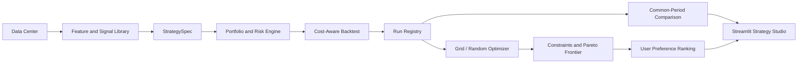

# Strategy Studio Architecture

## Contracts

`StrategySpec` is the user-facing strategy contract. It references immutable
market and signal inputs and describes portfolio, risk, and execution rules.

`StrategyStudioRunner` converts the spec into the existing tested
`StrategyPipeline` and `BacktestEngine`. It does not implement an alternate
backtester.

`StrategyRunRegistry` treats each run directory as an append-only record. A run
contains the exact spec, hashes, metrics, holdings, trades, and equity curve.

`StrategyOptimizer` creates normal registered runs, aligns their curves to a
common period, applies constraints, and identifies Pareto-efficient candidates.

`recommend_strategies` applies a user profile after optimization. It ranks
historical candidates and explains tradeoffs; it is not a forecast guarantee.
